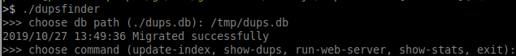
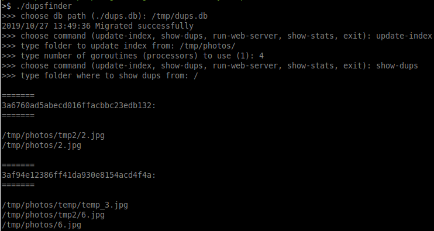

# dupsfinder

Duplicates finder implementation in golang. It has command line interface. To run:

```bash
./dupsfinder
```

then it will ask you what you'd like to do:



The application is built around the index database (SQLite), in this case `tmp/dups.db`. To update its index, you can run `update-index` and point to the folder you need and then run `show-dups`:



You can also run a web server (`run-web-server`) and search file duplicates there.

## TODO:

* There is no pagination on a web page with duplicates.
* Refactoring